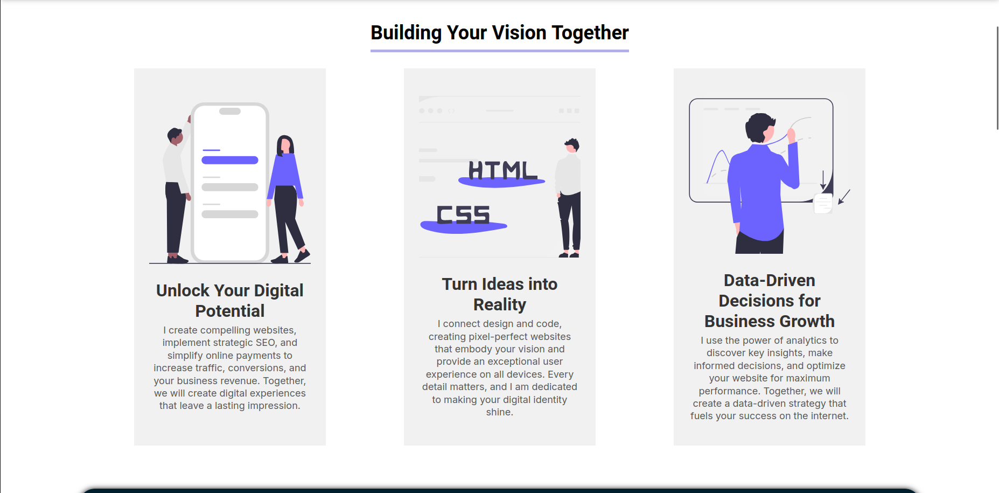
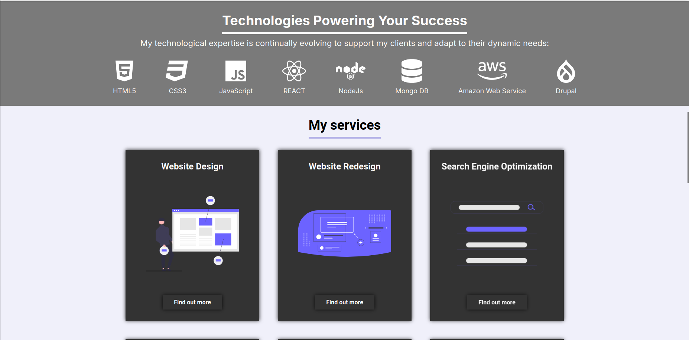
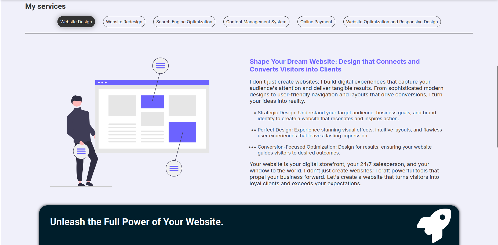
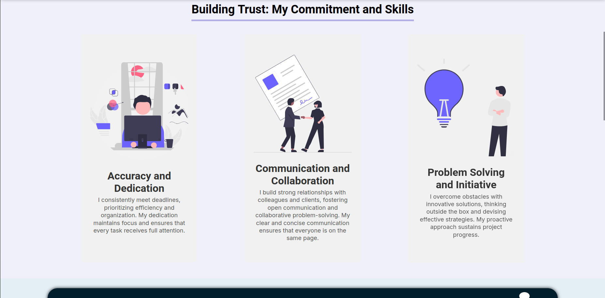
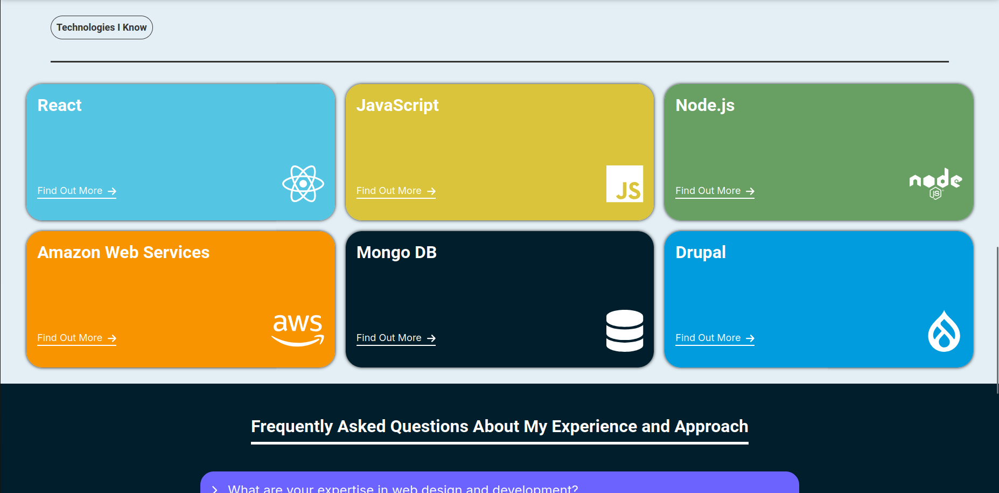
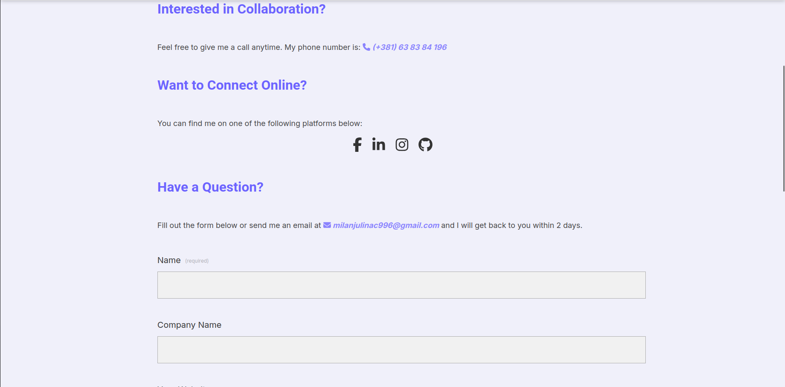

### Description

This dynamic and visually appealing website showcases your IT company's expertise and offerings. With a sleek, modern design and smooth animations, it provides a seamless user experience across all devices.

#### Homepage

The homepage immediately grabs attention with a captivating hero section, highlighting company's core values and services. A clear navigation menu allows visitors to easily explore the website's content.

#### Services

The services page provides detailed information about the IT solutions you offer. Each service is presented with engaging visuals and concise descriptions, making it easy for clients to understand the benefits and applications of expertise.

#### About Us

The about us page tells the story of company, highlighting mission and vision. Through compelling storytelling and relevant imagery, this page establishes trust and credibility with potential clients.

#### Contact

The contact page provides multiple channels for clients to get in touch. A convenient contact form, along with email addresses and phone numbers, ensures easy communication and efficient inquiries

### Tech & Experience

This frontend project was built using Next.js, a popular React framework for building server-rendered or statically generated websites. Next.js provided a robust foundation for the project, streamlining development and optimization. I leveraged React's component-based architecture and hooks to manage state and data flow effectively. Additionally, I employed styled components for creating reusable and themeable styles, ensuring a visually appealing and maintainable design.

Through this project, I gained a deeper understanding of Next.js's features, including server-side rendering, static site generation, and routing. I also honed my React development skills, focusing on component composition, state management, and data flow. This project has been invaluable in expanding my knowledge of modern frontend development practices and preparing me for building scalable and efficient web applications.

##### You can also find the code on GitHub: <u>[Code](https://github.com/MilanJulinac42/professional-portfolio)</u>
