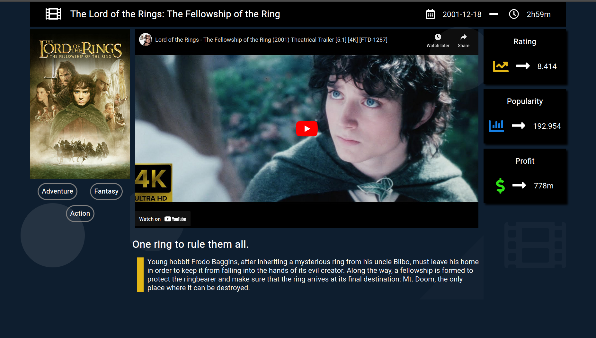
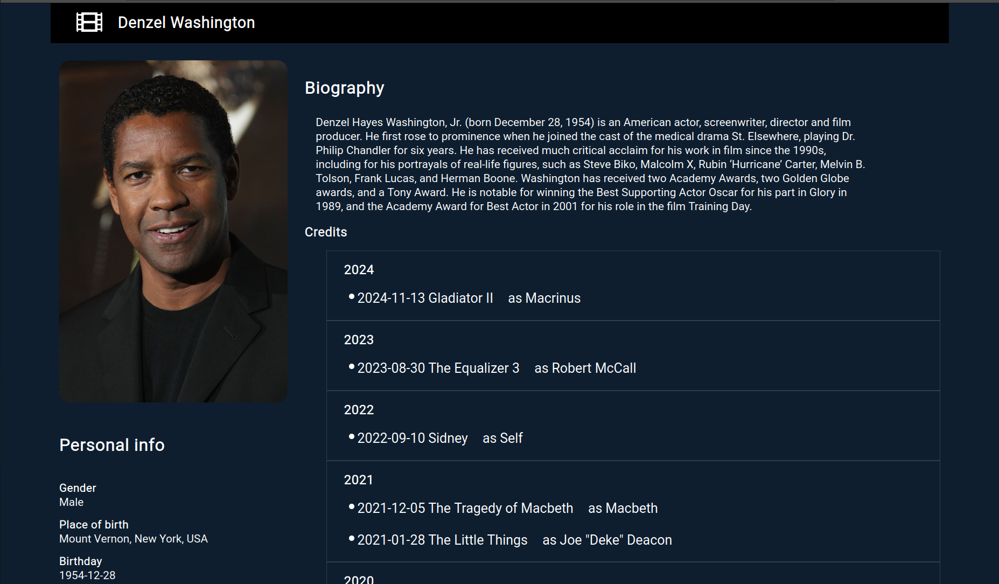

### Description

A dynamic, fully responsive website designed for browsing movies, tv shows and movie celebrities. Contains data from an open source database, you can go to a webpage of a specific movie, tv show or a celeb where you can find various data regarding those entities, ranging from user score, profit, description and trailer for movies and shows to biography and credits for celebs.

### Tech & Experience

I made this using React.js with hooks for managing and transferring data through components. Regarding style, I used a mixture of react styled components, inline css and classic css. Data was pulled from third party open source database.

It was excellent practising my skills in the most popular front end framework. Working with data sets this big gave me a new perspective about structuring react components hierarchy as well as managing and transferring data with hooks.

##### Here's a link to my website: <u>[Live Version](https://confident-wright-f9b41b.netlify.app/)</u>

##### You can also find the code on GitHub: <u>[Code](https://github.com/MilanJulinac42/my-movie-app)</u>
